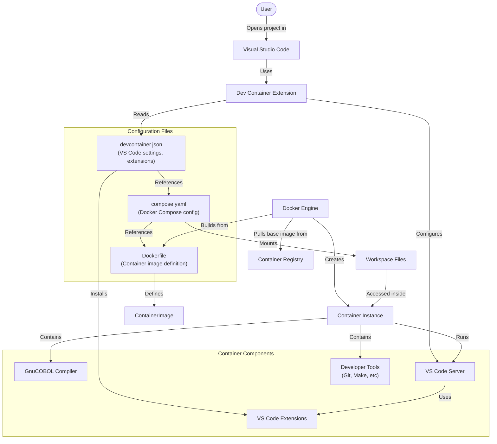

# 開発コンテナー（Dev Containers）

## Dev Containerとは？

Development Container（Dev Container）は、開発者がローカルマシンの設定に依存せず、一貫性があり、分離され、再現可能な開発環境で作業できるようにするコンテナ化された開発環境です。Dev ContainerはDockerコンテナを活用し、プロジェクトや技術スタックに必要なツール、ライブラリ、拡張機能、設定がすべて揃った事前構成済みの開発環境を提供します。

## Dev Containerを使うメリット

### 1. チーム全体での一貫性

すべての開発者が同一の開発環境で作業できるため、「自分の環境では動く」といった問題を排除できます。誰が書いたコードでも同じように動作します。

### 2. オンボーディングの簡素化

新しいメンバーも、ローカル環境のセットアップに何時間もかけることなく、すぐに開発を始められます。コマンド一つで、すぐに使える環境が手に入ります。

### 3. 環境の分離

Dev Containerはプロジェクトごとの依存関係やツールをローカルシステムから分離します。異なるプロジェクトごとに異なる言語やコンパイラ、ライブラリのバージョンを使っても互いに干渉しません。

### 4. 再現可能な環境

開発環境がリポジトリ内でコードとして管理されるため、バージョン管理・再現・更新が容易です。何か問題が起きても、コンテナを再構築すれば元の状態に戻せます。

### 5. クロスプラットフォーム対応

Dev ContainerはWindows、macOS、Linuxのどれでも同じように動作し、プラットフォーム固有の問題を解消します。

### 6. 本番環境との近似

開発環境を本番環境に近づけて構成できるため、環境差異によるデプロイ時の問題を減らせます。

## このCOBOLワークショップでのDev Container

このワークショップでは、COBOL開発用に特別に構成されたDev Containerを使用します。以下に、この環境を定義する設定ファイルを説明します。

# COBOLワークショップ Dev Container構成

このリポジトリの `.devcontainer` フォルダーには、COBOL開発環境を定義する設定ファイルが含まれています。

## Dockerfile

Dockerfileはマルチステージビルドを使い、最適化されたコンテナを作成します。

```dockerfile
FROM ubuntu:22.04 AS builder
# ビルダーステージでGnuCOBOLや依存パッケージをインストール
# ...

FROM ubuntu:22.04
# 最終イメージで必要なパッケージをインストール
# ...
```

主なポイント：

- **ベースイメージ**: Ubuntu 22.04 LTSを使用し、安定した基盤を提供
- **開発ツール**:
  - `gnucobol` - COBOL開発用コンパイラ
  - `libxml2` - XML処理ライブラリ
  - `git` - バージョン管理
  - `curl` - ネットワークユーティリティ
  - `make` - ビルド自動化

- **ユーザー設定**: `vscode` という非rootユーザーを作成し、sudo権限を付与。利便性とセキュリティを両立

## devcontainer.json

このファイルは、VS Codeがコンテナとどのように連携するかを設定します。

```json
{
    "name": "COBOL Development Environment",
    "dockerComposeFile": "compose.yaml",
    "service": "cobol",
    "workspaceFolder": "/workspace",
    "customizations": {
        "vscode": {
            "extensions": [
                "bitlang.cobol",
                "streetsidesoftware.code-spell-checker",
                "broadcom.cobol-language-support",
                "kainino.backgroundcopy",
                "ms-vscode.makefile-tools"
            ],
            "settings": {
                // COBOL向けに最適化されたVS Code設定
            }
        }
    },
    "remoteUser": "vscode",
    "postCreateCommand": "cobc --version && echo 'COBOL Environment Ready'"
}
```

主な特徴：

- **VS Code拡張機能**:
  - `bitlang.cobol` - 基本的なCOBOL言語サポート
  - `broadcom.cobol-language-support` - 高度なCOBOL言語機能
  - `ms-vscode.makefile-tools` - Makefileサポート

- **エディタ設定**:
  - カラムルーラー（6, 7, 72桁）でCOBOL固定書式に対応
  - タブ幅1、スペース挿入
  - COBOL向けフォーマット設定

- **Post-Creationコマンド**: COBOLコンパイラのインストール確認と準備完了メッセージ

## compose.yaml

このDocker Composeファイルは、コンテナの起動方法を定義します。

```yaml
services:
  cobol:
    hostname: devcontainer
    build:
      context: .
      dockerfile: Dockerfile
    volumes:
      - ..:/workspace:cached
    command: sleep infinity
    init: true
    mem_limit: 1g
    memswap_limit: 1g
    cpu_shares: 1024
```

主な設定：

- **ボリュームマウント**: プロジェクトルートを `/workspace` にマウント
- **リソース制限**:
  - メモリ上限: 1GB
  - CPU割り当て: 1024シェア
- **コンテナライフサイクル**: `sleep infinity` で常時起動

## Dev Containerアーキテクチャ

以下の図は、Dev Container構成の各コンポーネント間の関係を示します。



### 各コンポーネントの説明

1. **ユーザー操作の流れ**:
   - ユーザーがVS Codeでプロジェクトを開く
   - Dev Container拡張が設定を検出
   - `devcontainer.json` を読み込み、コンテナ設定を把握
   - Dockerが設定ファイルに従いコンテナをビルド・起動

2. **設定ファイルの関係**:
   - `devcontainer.json`: VS Codeが読むメイン設定ファイル
   - `compose.yaml`: devcontainer.jsonから参照され、Docker Composeを設定
   - `Dockerfile`: compose.yamlから参照され、コンテナイメージを定義

3. **実行時コンポーネント**:
   - **GnuCOBOLコンパイラ**: COBOL開発のメインツール
   - **VS Code Server**: コンテナ内で動作するサーバー側コンポーネント
   - **拡張機能**: COBOL開発を強化するVS Code拡張
   - **開発ツール**: GitやMakeなどの追加ツール

4. **データフロー**:
   - ワークスペースファイルはホストからコンテナにマウント
   - コンテナ内のツールやコンパイラがこれらのファイルにアクセス
   - VS Codeはコンテナ内のサーバーと通信

このアーキテクチャにより、すべての開発作業が分離されたコンテナ内で行われ、VS Codeを通じてシームレスな体験が得られます。

## このワークショップでのDev Containerの動作

このプロジェクトをVS Codeで開くと：

1. VS Codeが `.devcontainer` フォルダーを検出し、コンテナで再オープンするよう促します
2. 承認すると、Dockerfileに従ってDockerイメージをビルド
3. Docker Composeが指定リソース制限でコンテナを起動
4. VS Codeが起動中のコンテナに接続
5. 指定された拡張機能が自動インストール
6. エディタがCOBOL向けに設定
7. すぐにCOBOL開発が可能な状態に

この仕組みにより、すべての参加者が以下のような同一環境で作業できます。

- 同じGnuCOBOLコンパイラバージョン
- COBOL固定書式に最適なエディタ設定
- 必要なツール・ライブラリが事前インストール済み
- COBOL開発に最適なVS Code拡張

## Dev Containerの使い方

コンテナが起動したら、以下のことが可能です。

1. VS CodeタスクやMakefileでCOBOLアプリケーションをビルド
2. コンテナ内でアプリケーションを直接実行
3. GnuCOBOLコンパイラ（`cobc`）でコンパイル
4. 統合ターミナルからすべてのツールにアクセス

このコンテナ化アプローチにより、環境構築の心配なくCOBOLやモダナイゼーション技術の学習に集中できます。

## Dev Containerのカスタマイズ

必要に応じて、設定ファイルを編集してDev Containerをカスタマイズできます。

- Dockerfileに追加パッケージをインストール
- devcontainer.jsonで拡張機能を追加
- compose.yamlでリソース制限を調整

変更後は、VS Codeの「Rebuild Container」コマンドで再構築できます。
