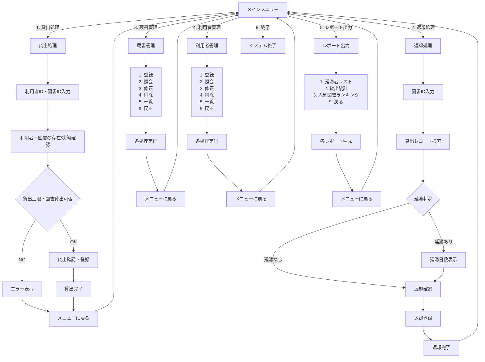

# 図書館管理システム 処理フロー

```mermaid
flowchart TD
    menu[メインメニュー] -->|1. 貸出処理| loan[貸出処理]
    menu -->|2. 返却処理| ret[返却処理]
    menu -->|3. 蔵書管理| book[蔵書管理]
    menu -->|4. 利用者管理| user[利用者管理]
    menu -->|5. レポート出力| report[レポート出力]
    menu -->|9. 終了| systemEnd[システム終了]

    %% 貸出処理
    loan --> loan1[利用者ID・図書ID入力]
    loan1 --> loan2[利用者・図書の存在/状態確認]
    loan2 --> loan3{貸出上限・図書貸出可否}
    loan3 -- OK --> loan4[貸出確認・登録]
    loan3 -- NG --> loan5[エラー表示]
    loan4 --> loan6[貸出完了]
    loan5 --> loan7[メニューに戻る]
    loan6 --> loan7
    loan7 --> menu

    %% 返却処理
    ret --> ret1[図書ID入力]
    ret1 --> ret2[貸出レコード検索]
    ret2 --> ret3{延滞判定}
    ret3 -- 延滞あり --> ret4[延滞日数表示]
    ret3 -- 延滞なし --> ret5[返却確認]
    ret4 --> ret5
    ret5 --> ret6[返却登録]
    ret6 --> ret7[返却完了]
    ret7 --> menu

    %% 蔵書管理
    book --> book1["1. 登録\n2. 照会\n3. 修正\n4. 削除\n5. 一覧\n9. 戻る"]
    book1 --> book2[各処理実行]
    book2 --> book3[メニューに戻る]
    book3 --> menu

    %% 利用者管理
    user --> user1["1. 登録\n2. 照会\n3. 修正\n4. 削除\n5. 一覧\n9. 戻る"]
    user1 --> user2[各処理実行]
    user2 --> user3[メニューに戻る]
    user3 --> menu

    %% レポート出力
    report --> report1["1. 延滞者リスト\n2. 貸出統計\n3. 人気図書ランキング\n9. 戻る"]
    report1 --> report2[各レポート生成]
    report2 --> report3[メニューに戻る]
    report3 --> menu
```
