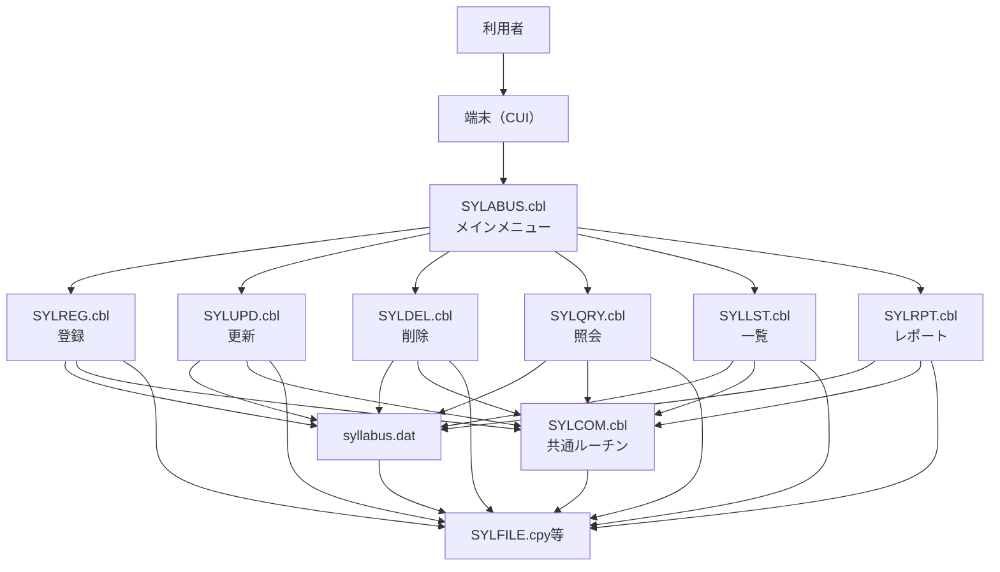

# シラバス管理システム 設計書テンプレート

---

## 1. システム概要

- システム名：
- 対象業務：
- システムの目的・特徴：
- 現行言語・プラットフォーム：COBOL（GnuCOBOL）/ Windows/Linux
- 今後のリプレース予定：有（予定言語・環境：＿＿＿＿）

---

## 2. 業務要件・機能一覧

| 機能ID | 機能名         | 概要                                                         | 現COBOLプログラム名 | 備考                                   |
|--------|----------------|--------------------------------------------------------------|---------------------|----------------------------------------|
| F01    | シラバス登録   | 新規シラバス情報（科目、教員、学部、概要等）の登録           | SYLREG.cbl          | 入力画面・週次計画入力あり             |
| F02    | シラバス更新   | 既存シラバス情報の修正（項目単位で編集・保存）               | SYLUPD.cbl          | 画面選択式・項目別編集                 |
| F03    | シラバス削除   | シラバス情報の削除（科目コード指定、確認画面あり）            | SYLDEL.cbl          | 削除前に確認画面表示                   |
| F04    | シラバス照会   | シラバス情報の個別照会（科目コード指定、詳細・週次表示）      | SYLQRY.cbl          | 詳細画面・週次計画画面                 |
| F05    | シラバス一覧   | シラバス情報の一覧表示（全件・条件指定・ページング対応）       | SYLLST.cbl          | 学部・教員・学期等で絞込可             |
| F06    | レポート出力   | シラバス情報のレポート生成（全件・学部別・教員別等）           | SYLRPT.cbl          | テキストファイル出力                   |
| F07    | 共通ルーチン   | コード・日付等のバリデーション、エラーメッセージ生成           | SYLCOM.cbl          | 他プログラムからCALLで利用             |
| F08    | メインメニュー | システム全体のメニュー表示・各機能への遷移                   | SYLABUS.cbl         | 画面メニュー・機能選択                 |
| ...    |                |                                                              |                     |                                        |

---

## 3. システム構成図

### 3.1 アーキテクチャ概要

- **現行構成**:  
  - オンラインバッチ混在型（CUIベース、COBOLプログラム群）
  - データファイルはローカルファイル（Indexed Sequential File）で管理
  - 画面I/OはCOBOL SCREEN SECTIONによるCUI画面
- **リプレース後想定**:  
  - WebアプリケーションまたはAPI＋Web UI構成
  - データベース（RDBMS等）利用
  - モダンUIフレームワーク利用

### 3.2 システム構成図（例: 現行）

### 3.3 ファイル構成

- **データファイル**
  - `syllabus.dat`（シラバスマスター／Indexed File）
- **コピー句（Copybook）**
  - `SYLFILE.cpy`（シラバスレコード定義）
  - `LIBERROR.cpy`（エラー定義・メッセージ）
- **プログラム**
  - `SYLABUS.cbl`（メインメニュー）
  - `SYLREG.cbl`（登録）
  - `SYLUPD.cbl`（更新）
  - `SYLDEL.cbl`（削除）
  - `SYLQRY.cbl`（照会）
  - `SYLLST.cbl`（一覧）
  - `SYLRPT.cbl`（レポート）
  - `SYLCOM.cbl`（共通ルーチン）

### 3.4 外部インターフェース

- 現行：特になし（スタンドアロン運用）
- リプレース後：他システム連携（API等）を想定する場合はここに記載

---

## 4. データ設計

### 4.1 論理データモデル（ER図）

- **エンティティ一覧**
  - シラバス（SYLLABUS）
  - 学部・学科（DEPARTMENT）
  - 教員（TEACHER）
  - （必要に応じて）ユーザー、履修者、履修登録など

- **主な属性・キー**
  - シラバス: 科目コード（主キー）、科目名、学部学科コード、教員ID、学期、単位数、授業概要、学習目標、週次計画
  - 学部・学科: 学部学科コード（主キー）、名称
  - 教員: 教員ID（主キー）、氏名、所属学部、連絡先等

- **ER図例（テキスト記述）**
  - SYLLABUS (SYL-COURSE-ID) ---< DEPARTMENT (SYL-DEPARTMENT-ID)
  - SYLLABUS (SYL-TEACHER-ID) ---< TEACHER (TEA-ID)

### 4.2 物理データ定義

#### 4.2.1 シラバスファイル（syllabus.dat）

| 項目名             | 型・桁数      | 説明           | COBOL定義例           | リプレース時の型例 |
|--------------------|--------------|----------------|-----------------------|-------------------|
| SYL-COURSE-ID      | X(6)         | 科目コード     | PIC X(6)              | VARCHAR(10)       |
| SYL-COURSE-NAME    | X(30)        | 科目名         | PIC X(30)             | VARCHAR(100)      |
| SYL-DEPARTMENT-ID  | X(4)         | 学部学科コード | PIC X(4)              | VARCHAR(10)       |
| SYL-TEACHER-ID     | X(5)         | 教員ID         | PIC X(5)              | VARCHAR(10)       |
| SYL-SEMESTER       | X(2)         | 学期           | PIC X(2)              | VARCHAR(4)        |
| SYL-CREDITS        | 9            | 単位数         | PIC 9                 | INTEGER           |
| SYL-DESCRIPTION    | X(200)       | 授業概要       | PIC X(200)            | TEXT              |
| SYL-OBJECTIVES     | X(100)       | 学習目標       | PIC X(100)            | TEXT              |
| SYL-WEEK-PLAN      | X(30)×15     | 週次計画       | OCCURS 15 TIMES PIC X(30) | TEXT/ARRAY      |

#### 4.2.2 学部・学科ファイル（例: department.dat）

| 項目名             | 型・桁数      | 説明           | COBOL定義例           | リプレース時の型例 |
|--------------------|--------------|----------------|-----------------------|-------------------|
| DEP-ID             | X(4)         | 学部学科コード | PIC X(4)              | VARCHAR(10)       |
| DEP-NAME           | X(30)        | 学部学科名     | PIC X(30)             | VARCHAR(100)      |

#### 4.2.3 教員ファイル（例: teacher.dat）

| 項目名             | 型・桁数      | 説明           | COBOL定義例           | リプレース時の型例 |
|--------------------|--------------|----------------|-----------------------|-------------------|
| TEA-ID             | X(5)         | 教員ID         | PIC X(5)              | VARCHAR(10)       |
| TEA-LAST-NAME      | X(20)        | 姓             | PIC X(20)             | VARCHAR(50)       |
| TEA-FIRST-NAME     | X(20)        | 名             | PIC X(20)             | VARCHAR(50)       |
| TEA-DEPARTMENT-ID  | X(4)         | 所属学部       | PIC X(4)              | VARCHAR(10)       |
| TEA-TITLE          | X(15)        | 職位           | PIC X(15)             | VARCHAR(30)       |
| TEA-SPECIALIZATION | X(30)        | 専門分野       | PIC X(30)             | VARCHAR(100)      |
| TEA-OFFICE-LOCATION| X(15)        | 研究室         | PIC X(15)             | VARCHAR(30)       |
| TEA-PHONE          | X(15)        | 電話番号       | PIC X(15)             | VARCHAR(20)       |
| TEA-EMAIL          | X(30)        | メール         | PIC X(30)             | VARCHAR(100)      |
| TEA-HIRE-DATE      | 9(4)+9(2)+9(2)| 採用日        | 9(4)年,9(2)月,9(2)日  | DATE              |
| TEA-STATUS         | X(1)         | 状態           | PIC X                 | CHAR(1)           |

#### 4.2.4 エラー定義（LIBERROR.cpy）

| 項目名             | 型・桁数      | 説明           | COBOL定義例           | リプレース時の型例 |
|--------------------|--------------|----------------|-----------------------|-------------------|
| ERROR-CODE         | X(4)         | エラーコード   | PIC X(4)              | VARCHAR(10)       |
| ERROR-MESSAGE      | X(80)        | エラーメッセージ| PIC X(80)             | VARCHAR(255)      |

---

## 5. 画面設計

- 画面ID・名称
- レイアウト（項目配置図・モックアップ）
- 入力・出力項目
- バリデーション仕様
- 操作フロー

---

## 6. 業務フロー・処理フロー

- 業務プロセス図（BPMN等）
- 各機能の処理手順（現行COBOL段階のパラグラフ構成も記載）

---

## 7. 移行・リプレース設計観点

- 現行COBOL特有の仕様・注意点
- リプレース時の設計方針（例：データ型変換、画面UI刷新、バッチ→API化等）
- テスト観点（現行・新システムの突合せ方法）

---

## 8. 非機能要件

- パフォーマンス
- セキュリティ
- 運用・保守
- ロギング・監査

---

## 9. その他・備考

- 用語集
- 参考資料
- 汎用ルール・コーディング規約

---

*（本テンプレートはCOBOL現行資産の構造を明確化し、将来的な他言語リプレースを容易にするための設計観点を含みます）*
