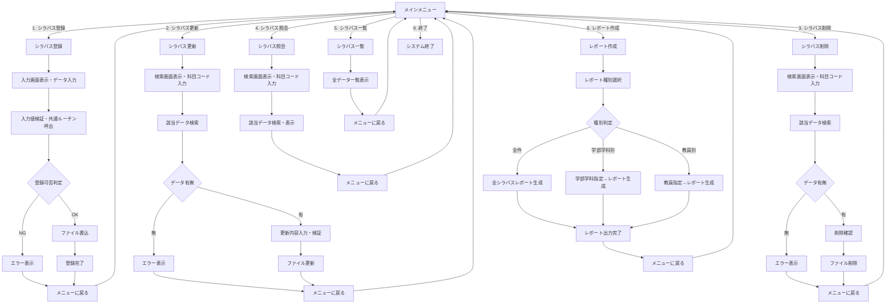

# シラバス管理システム 処理フロー

```mermaid
flowchart TD
    menu[メインメニュー] -->|1. シラバス登録| reg[シラバス登録]
    menu -->|2. シラバス更新| upd[シラバス更新]
    menu -->|3. シラバス削除| del[シラバス削除]
    menu -->|4. シラバス照会| qry[シラバス照会]
    menu -->|5. シラバス一覧| lst[シラバス一覧]
    menu -->|6. レポート作成| rpt[レポート作成]
    menu -->|9. 終了| systemEnd[システム終了]

    %% シラバス登録
    reg --> reg1[入力画面表示・データ入力]
    reg1 --> reg2[入力値検証・共通ルーチン呼出]
    reg2 --> reg3{登録可否判定}
    reg3 -- OK --> reg4[ファイル書込]
    reg3 -- NG --> reg5[エラー表示]
    reg4 --> reg6[登録完了]
    reg5 --> reg7[メニューに戻る]
    reg6 --> reg7
    reg7 --> menu

    %% シラバス更新
    upd --> upd1[検索画面表示・科目コード入力]
    upd1 --> upd2[該当データ検索]
    upd2 --> upd3{データ有無}
    upd3 -- 有 --> upd4[更新内容入力・検証]
    upd3 -- 無 --> upd5[エラー表示]
    upd4 --> upd6[ファイル更新]
    upd5 --> upd7[メニューに戻る]
    upd6 --> upd7
    upd7 --> menu

    %% シラバス削除
    del --> del1[検索画面表示・科目コード入力]
    del1 --> del2[該当データ検索]
    del2 --> del3{データ有無}
    del3 -- 有 --> del4[削除確認]
    del3 -- 無 --> del5[エラー表示]
    del4 --> del6[ファイル削除]
    del5 --> del7[メニューに戻る]
    del6 --> del7
    del7 --> menu

    %% シラバス照会
    qry --> qry1[検索画面表示・科目コード入力]
    qry1 --> qry2[該当データ検索・表示]
    qry2 --> qry3[メニューに戻る]
    qry3 --> menu

    %% シラバス一覧
    lst --> lst1[全データ一覧表示]
    lst1 --> lst2[メニューに戻る]
    lst2 --> menu

    %% レポート作成
    rpt --> rpt1[レポート種別選択]
    rpt1 --> rpt2{種別判定}
    rpt2 -- 全件 --> rpt3[全シラバスレポート生成]
    rpt2 -- 学部学科別 --> rpt4[学部学科指定→レポート生成]
    rpt2 -- 教員別 --> rpt5[教員指定→レポート生成]
    rpt3 --> rpt6[レポート出力完了]
    rpt4 --> rpt6
    rpt5 --> rpt6
    rpt6 --> rpt7[メニューに戻る]
    rpt7 --> menu
```
